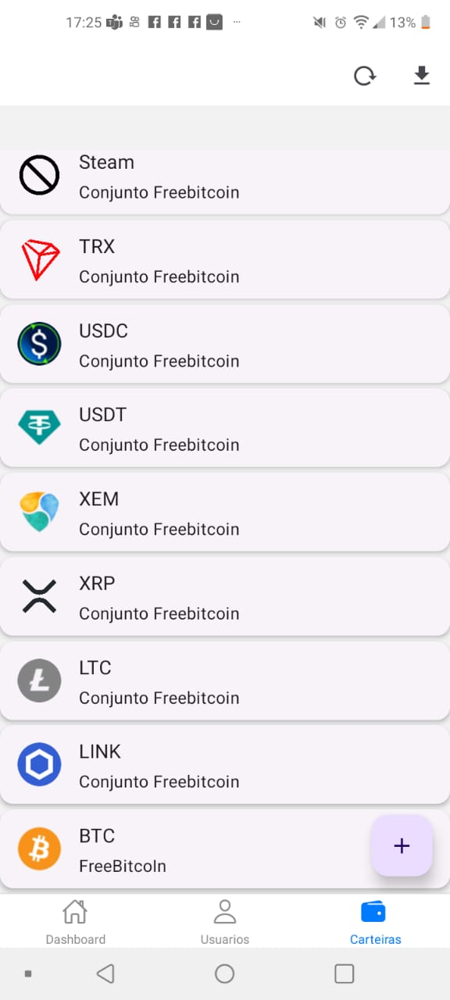

# FaucetCollector
Coletor de Criptomoedas

## Instalação
- Aplicativo disponível apenas para android. [Link disponível aqui](https://github.com/leandroZanatta/faucet-collector/raw/main/app-release.apk)
- Como não está disponível na play store, precisa de autorização de fontes desconhecidas
- Abra o apk e autorize a instalação, um ícone será adicionado no seu celular.

## Configuração

##### Usuários

- Abra o aplicativo pelo ícone no seu celular. 
- Acesse o menu de usuários
- Pressione o botão + para adicionar um novo usuário
- <b>Apelido:</b> Insira seu nome. 
- <b>Código de Referência:</b> Insira 1. 
- <b>Email:</b> Insira seu email. 
- <b>Senha:</b> Insira uma senha com no mínimo 8 dígitos. 
- <b>Repita a senha:</b> Repita a senha 
    -   Esta senha será utilizada para acesso em cada site para efetuar a coleta 
- Após o cadastro, Um novo registro aparecerá.

##### Registrando criptomoedas
- Acesse o menu Carteiras
- Pressione o botão + para adicionar uma nova carteira

- Email - Dados vem preenchidos com email do usuário, PODE SER ALTERADO
- Senha - Dados vem preenchidos com senha do usuário, PODE SER ALTERADO
- Carteiras
   - Selecione uma ou mais carteiras.
- Situações:
   - Validação Pendente - Quando selecionado apenas 1 carteira(Faz uma checagem para verificar a situação(cadastrada/não cadastrada) com os dados de login
   - Não Cadastrado - Quando selecionado apenas 1 carteira(Efetua o cadastro no site da respectiva carteira) com os dados de login
   - Validado - Ignora quaisquer verificações e salva as carteiras(Se tiver certeza que já está cadastrado e validado, e as informações de login estão corretas)

##### Dashboard

Exibe o processo de execução dos faucets(horário da proxima execução, percentual para saque, valor Total das carteiras na cotação atual)

- Possui 2 botões na parte superior.
  - Forçar sincronização: Processos do android só podem ser executados de 15 em 15 minutos. Este botão força a execução para o momento atual.
  - Atualização do apk: Com este botão é possível manter sempre atualizado seu aplicativo. 
