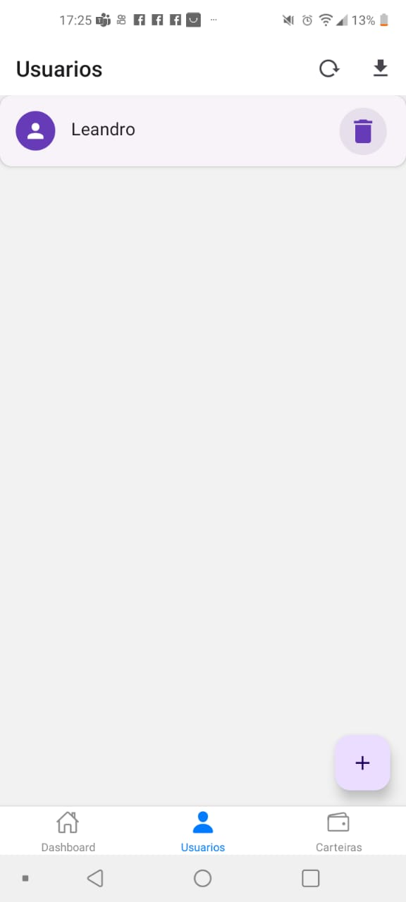
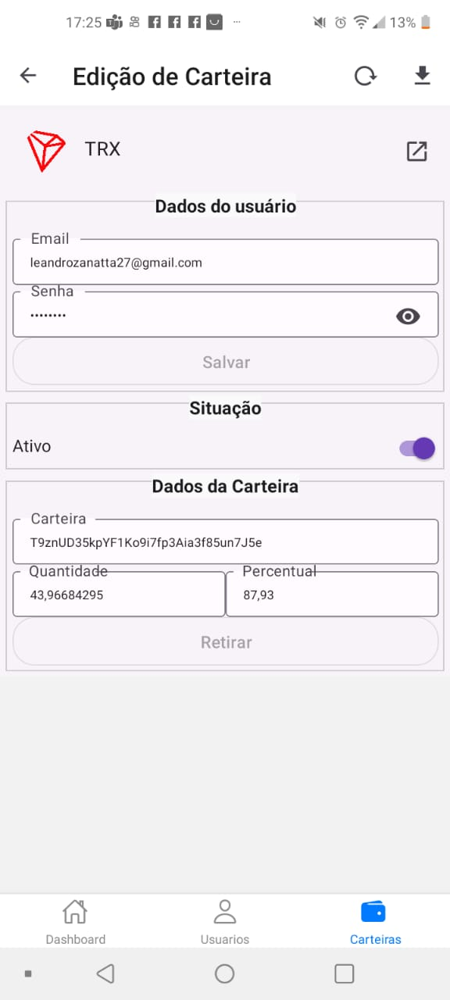

# FaucetCollector
Coletor de Criptomoedas

## Instalação
- Aplicativo disponível apenas para android.
- Como não está disponível na play store, precisa de autorização de fontes desconhecidas
- Abra o apk e autorize a instalação, um ícone será adicionado no seu celular.

## Configuração

##### Dados iniciais
- Abra o aplicativo pelo ícone no seu celular. 
 
- <b>Apelido:</b> Insira seu nome. 
- <b>Código de Referência:</b> Insira 1. 
- <b>Email:</b> Insira seu email. 
- <b>Senha:</b> Insira uma senha com no mínimo 8 dígitos. 
- <b>Repita a senha:</b> Repita a senha 
    -   Esta senha será utilizada para acesso em cada site para efetuar a coleta 

##### Registrando criptomoedas
 
- Pode ser observado que ao canto esquerdo de cada moeda existe uma barra de status, onde cada cor possui um significado. 
    - <b>Vermelho:</b> Não Cadastrado 
    - <b>Amarelo:</b> Necessita validação do email 
    - <b>Azul:</b> Criptomoeda apta á coletar 
- Para efetuar o cadastro de cada criptomoeda, clique no ícone em forma de núvem. 
  - A barra de status será alterada de Vermelho para amarelo 

- Acesse seu email. Verá que para cada criptomoeda foi enviado um email de confirmação, copie a url, e volte para o aplicativo 
  - Ao tocar na imagem correspondente a criptomoeda uma nova tela se abrirá 

  - Insira o código copiado no email no campo designado, e clique no ícone ao lado direito. 
  
#### Caso todo procedimento seja realizado corretamente, seu aplicativo estará apto a coletar as criptomoedas cadastradas
  
- Podemos ver nesta tela várias informações referentes a coleta de criptomoedas 
  - <b>Percentual de coleta: </b> Precisa atingir 100% para conseguir retirar do site para uma carteira de sua preferência 
  - <b>Quantidade atual coletada: </b> Saldo atual da carteira 
  - <b>Data da próxima coleta: </b> Data aproximada em que a próxima coleta será executada 
  
- Saldo atual em reais e uma estimativa com base na cotação atual, qual o valor aproximado em reais de cada criptomoeda  
 
